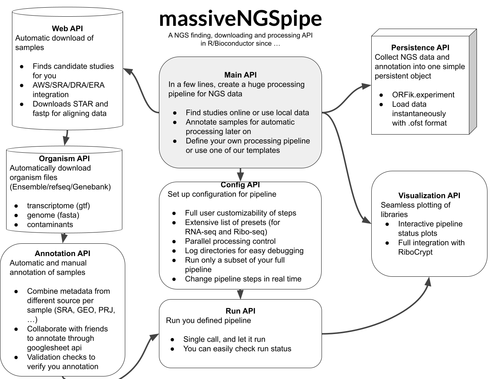

This package is under heavy development to include more features, API is not
stable!

### About

massive_NGS_pipe is a R package for full process integration of
NGS studies, it can handle thousands of samples from multiple organisms
in a single run.

It currently supports to set up easily a fail safe and fallback supported 
pipeline that does the specific steps:
- Find candidate accessions for studies you might be interested in
- A clean way of helping with annotating samples using
either google sheet integration or local csv files.
- Automatic download of genome and gff for each organism (supports
fixing malformed gffs, adding pseudo 5' UTRs etc)
- Automatic download of samples with fallback options:
 1. AWS (amazone, fastest), 2. ENA (fast), 3. fastq-dump (slowest)
- Automatic detection of 3' adapters and trimming (fastp)
- Collapsing of duplicated reads for faster processing
- barcode / UMI detection / removal (To be implemented)
- Autmoatic removal of contaminants: phix, rRNA, tRNA,..
- Genome alignment with STAR (with QC)
- Create ORFik.experiment object for easy analysis in R
- Convert output files to any format: bigwig, wig, bed, ofst etc.
- Merging of samples by type

Ribo-seq specific:
- automatic pshifting and quality validation

Visulization specific:
Our data output is directly supported to be browsed by the
RiboCrypt visuzliation tool which supports among others:
- Both genomic and transciptomic view browser
- Differential expression
- Read length heatmaps
- Codon usage
- And much more

### Primary pipeline (Data from online repository)

Package is also available here on github
```r
library(massiveNGSpipe)
## Setup
config <- pipeline_config() # <- set up paths
## Curate metadata
accessions <- accessions_to_use("GSE152850", "Saccharomyces cerevisiae", FALSE)
curate_metadata(accessions, config, "Saccharomyces cerevisiae")
## Init pipeline and show current progress report
pipelines <- pipeline_init_all(config) # Initialize pipeline configuration for all experiments
progress_report(pipelines, config)
# Start the pipeline (In RStudio start this step with the 'background jobs' tab)
run_pipeline(pipelines, config, wait = 100, BPPARAM = bpparam())
```  

### Installation

Package is currently only available here on github
```r
if (!requireNamespace("devtools", quietly=TRUE))
    install.packages("devtools")
devtools::install_github("rc-biotech/massive_NGS_pipe")
```  

### Requirements

Software

- R programming language
- Unix OS (Linux or macOS), (or Windows Subsystem for Linux (WSL2))

Hardware

- Large genomes (like human, mouse, ...): (minimum 32GB memory)
- For small genomes (Yeast, E.coli, ...): (minimum 16GB memory)

Running with many cores will use more memory, we have seen
cases of a 800 sample study using up to 120GB memory on a large server when using > 50 cores.


### Local pipeline (Data from personal hard drive / local server)

To run your local data, you run the pipeline, but skips the steps of 
downloading. You also need to annotate the basic sample metadata yourself,
since it does not exist online yet. 

```r
library(massiveNGSpipe)
config_dirs <- ORFik::config() # Where all data is stored (all your pipelines)
# -> project_dir specifies log, status and metadata folder for specific pipeline
project_dir <- file.path(dirname(config_dirs)[1], "test_pipeline")
mode <- "local" # Data already exists on your computer / server
google_url <- NULL # Do not use google sheet for metadata storage
preset <- "Ribo-seq" # What kind of pipeline (use Ribo-seq preset)

# Init config (set up paths and pipeline settings)
config <- pipeline_config(project_dir, config_dirs, mode = mode,
                          preset = preset, google_url = google_url)

# Now, for local data you need to define a data.table with local file metadata
# Do this for each experiment (split experiment for each organism)
name <- "local_mNGSp_run_test" # This is the folder name in the fastq folder
organism <- "Homo sapiens"
organism_caps <- gsub(" ", "_", trimws(tolower(organism)))
path <-  paste(name, organism_caps, sep = "-")
path_full <- file.path(config$config["fastq"], path)
stopifnot(basename(path) == path) # relative path only!
stopifnot(dir.exists(path_full)) # Must exist!

save_file <- file.path(config[["metadata"]],
                       paste0("SraRunInfo_", name, ".csv"))
# Add all information needed here
dt <- local_study_csv(path_full, name, organism = organism,
                      paired = "SINGLE", AUTHOR = "Håkon",
                      sample_title = c("WT_ribo_cycloheximide_rep1",
                                       "WT_ribo_cycloheximide_rep2"))
dir.create(dirname(save_file), FALSE, TRUE)
fwrite(dt, save_file)

# Now for all experimental directories, validate metadata
all_names <- c(name) # Add all here (here we did only 1)
# Now run this, when you get to validation either open your csv and set
# the KEEP column to TRUE, for sample you want to run.
# Or do as bellow to run and update KEEP column in R
curate_metadata(all_names, config)

# R way of setting samples to run.
temp <- fread(config$temp_metadata)
temp$KEEP <- TRUE
fwrite(temp, config$complete_metadata)
curate_metadata(all_names, config)

# Now init pipeline objects and run pipeline
pipelines <- pipeline_init_all(config)

run_pipeline(pipelines, config, wait = 20, BPPARAM = SerialParam())
```

### The flow of data through the pipeline (theory)

The pipeline consists of several steps where the user can add their custom
steps. Here we will walk through the 4 main steps:


#### pipeline_config (Where should the pipeline save stuff, what functions to run, how to get data)

pipeline_config is the first function you will call to init a new pipeline.

It sets up 3 main steps:

- Directories (for data and metadata (with google sheet integration))
- Steps of action (function to be done, and how they are grouped), we call these
'flags' and each flag has a function to implements the logic.
- Setup for Parallel processing and how to log errors.

Important to remember is that the pipeline has 2 main modes:
- 'online': for online repository data
- 'local': for local machine / server data

Since the input steps are just a set of input function, you as a user can fully
custimize the pipeline. 

#### curate_metadata (Which samples to run and what are they)

curate_metadata is the function to set up and validate metadata.
There are 3 main steps:

For each study you have, per organism, we define a data structure:

- Which samples to use: For online mode, samples are identified by Run ids (SRR, ERR, DRR,...) and study id will be the bioproject id, SRP, etc.,
for local mode, samples are identified by relative file names, and studies are 
folders (one folder per organism, if local study is multi-species).
- Metadata extraction: When primary metadata is set up (where are the samples, which organism), we need to make sure we have a unique experimental identifier per sample. Like Ribo-seq Wild type cyclohexamide rep1. 
- Automatic validation: We then run through a automatic validation
of the metadata and the user will be informed if the information is not sufficient. 

#### pipeline_init_all (Create pipeline objects (per study per organism), download genomes)

When the curate_metadata step is complete and you have got a valid set of input data, you are good to go. This steps sets up the pipeline object: the object you actually feed into the main run. 

It takes the config and the completed metadata table, it then sets up 3 important things:
- Where should raw files, processed files and experiments be stored for this specific study?
- Which genome and index does it use?
- What is the metadata for this specific study?

#### run_pipeline (Start processing)

We advice you to always run this in a background job in RStudio, 
to 
run_pipeline uses the results from the parts:
- pipeline_init_all object (all data needed per study/organism to run )
- pipeline_config (the pipeline config, what to do etc.)

It then runs each function in a safe wrapper that if it fails it stores
error to a log and let's you know. It then continues to the next pipeline object.
When all objects are done it will retry the ones that failed.

You can also get a progress report of how long you have come. 

# Overview of making metadata for massiveNGSpipe:


## Metadata introduction
Samples need to be structured be able to run through a pipeline.

More specifically, we require a minimum set of datapoints, and 
for each library (Run), the set of datapoints must be unique.

### ENTREZ run summary

The way we do this in is to use a csv file (a google sheet):

It is structured in this way:

For each study we get the run summary, a csv file from the ENTREZ database:

Each row in the run summary represents a run (a fastq file, pair of fastq file (paired end))

These are the important columns:

- Run number: SRR, ERR, DRR (Run)
- Study accession (BioProject)
- Single end or paired end (LibraryLayout)
- Organism it came from (ScientificName)

To gather what the sample is:

- library type is it Ribo-seq
- condition (is it wild type or knock out, over expression)
- timepoint (2 days post fertilization, 2 hours of drug treatment)
- replicate (replicate 1, replicate 2, ..),

We need to know where to find these datapoints.

Here we order columns to look at in probability of finding useful information:

- sample_title (Sample title given by author)
- sample_source (Source of sample given by author)
- LibraryName (Name of specific library, this is usually empty)

If not existing there, then we sadly have not enough data, and need to do a manual check in the web-page for now:

We advice using geo like this:

https://www.ncbi.nlm.nih.gov/geo/query/acc.cgi?acc=GSM2664262

Where GSM... in ?acc=GSM is the GSM id found in the SampleName column.

## Automatic metadata detection with massiveNGSpipe

When you start curating data, massiveNGSpipe will try to auto-guess some columns with 
look up rules using regex and uniqueness of runs.

These columns will be added:
- LIBRARYTYPE	(RNA-seq, Ribo-seq, ..)
- REPLICATE	(Minimum index seperator, rep1, rep2, rep3,..)
- CONDITION	(WT (wild type), KO (knock out), mut (mutant),...)
- INHIBITOR	(chx (cyclohexamide), harr (harringtonin), ...)
- BATCH	(maximum index seperator, 1, 2, 3, ..) 
- TIMEPOINT	(2h (2 hours), 1d (1 day), ...)
- TISSUE	(kidney, liver, heart, ...)
- CELL_LINE	(HEK293, HeLa, ...)
- GENE		(RPL11, TOR, ATF4, ...)
- FRACTION	(Remaining uniqueness seperator: cytosolic, nuclear, dmso, silvesterol, ...)

The following goal is:
Per study, per organism: Get a unique set of the above columns.
If 2 rows (Runs) are identical, the validation test should fail.


Some additional rules:

BATCH vs replicate:
If there are technical replicates of biological replicates which are themselves grouped in batches, 
then replicate should be what seperates them most down the line. 
The is replicate is technical replicate etc.

How to use fraction column:
When additional data-points are required to split data data, this should be put in the fraction column, seperated by underscores "_".


