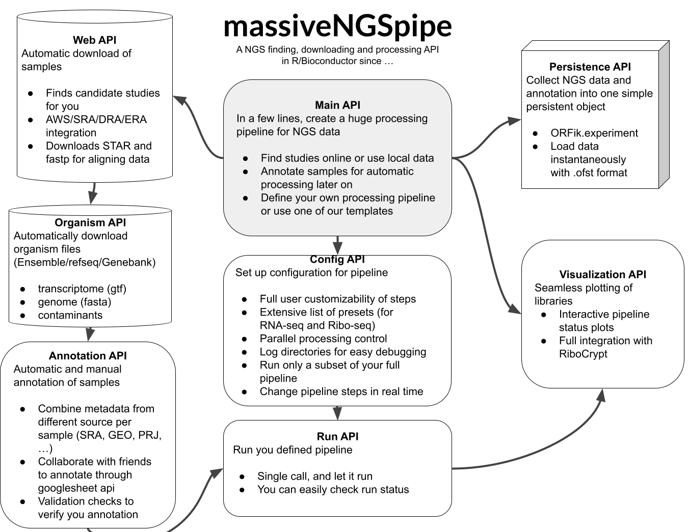

This package is under heavy development to include more features, API is not
stable!

### About

massiveNGSpipe is a R package for full process integration of
NGS studies, it can handle thousands of samples from multiple organisms
in a single run.

The pipelines flow is built on 4 steps:

- 1. Set up pipeline config (What steps to do: download, trimming, alignmnets) (presets supported)
- 2. Curate data (define which samples you want to run & metadata)
- 3. Download organism annotations from linked metadata per study (set up pipeline objects)
- 4. Run pipeline

It currently supports to set up easily a fail safe and fallback supported 
pipeline that does the specific steps:
- Find candidate accessions for studies you might be interested in
- A clean way of helping with annotating samples using
either google sheet integration or local csv files.
- Automatic download of genome and gff for each organism (supports
fixing malformed gffs, adding pseudo 5' UTRs, contamants etc)
- Automatic download of samples with fallback options:
 1. AWS (amazon, fastest), 2. ENA (fast), 3. fastq-dump (slowest)
- Automatic detection of 3' adapters and trimming (fastp)
- Collapsing of duplicated reads for faster processing
- barcode / UMI detection / removal (To be implemented)
- Autmoatic removal of contaminants: phix, rRNA, tRNA,..
- Genome alignment with STAR (with QC)
- Create ORFik.experiment object for easy analysis in R
- Convert output files to any format: bigwig, wig, bed, ofst etc.
- Merging of samples by type

Ribo-seq specific:
- automatic pshifting and quality validation

Visulization specific:
Our data output is directly supported to be browsed by the
RiboCrypt visuzliation tool which supports among others:
- Both genomic and transciptomic view browser
- Differential expression
- Read length heatmaps
- Codon usage
- And much more

### Primary pipeline (Data from online repository)

Package is also available here on github
```r
library(massiveNGSpipe)
## Setup
config <- pipeline_config(preset = "Ribo-seq") # <- set up paths
## Curate metadata
accessions <- accessions_to_use("GSE152850", "Saccharomyces cerevisiae", FALSE)
curate_metadata(accessions, config, "Saccharomyces cerevisiae")
## Init pipeline and show current progress report
pipelines <- pipeline_init_all(config) # Initialize pipeline configuration for all experiments
progress_report(pipelines, config)
# Start the pipeline (In RStudio start this step with the 'background jobs' tab)
run_pipeline(pipelines, config, wait = 100, BPPARAM = bpparam())
```  

### Installation

Package is currently only available here on github
```r
if (!requireNamespace("devtools", quietly=TRUE))
    install.packages("devtools")
devtools::install_github("rc-biotech/massiveNGSpipe", upgrade = "never")
```  

The `Remotes` field pins the data.table, fst, fstcore, and ORFik development
dependencies used by this checkout. Install into a separate R library when
comparing these forks with released versions, and use a fresh R session for
each library. `R CMD INSTALL` alone does not install `Remotes`; install those
dependencies first. The pinned ORFik commit provides the `filter_chunk_rows`
argument used by the organism merge helpers; an older ORFik build can have the
same package version without providing that API.

### Requirements

Software

- R programming language
- Unix OS (Linux or macOS), (or Windows Subsystem for Linux (WSL2))

Hardware

- Large genomes (like human, mouse, ...): (minimum 32GB memory)
- For small genomes (Yeast, E.coli, ...): (minimum 16GB memory)

Running with many cores will use more memory, we have seen
cases of a 800 sample study using up to 120GB memory on a large server when using > 50 cores.

### Local pipeline (Data from personal hard drive / local server)

To run your local data, you run the pipeline, but skips the steps of 
downloading. You also need to annotate the basic sample metadata yourself,
since it does not exist online yet. 

```r
library(massiveNGSpipe)
config_dirs <- ORFik::config() # Where all data is stored (all your pipelines)
# -> project_dir specifies log, status and metadata folder for specific pipeline
project_dir <- file.path(dirname(config_dirs)[1], "test_pipeline")
mode <- "local" # Data already exists on your computer / server
google_url <- NULL # Do not use google sheet for metadata storage
preset <- "Ribo-seq" # What kind of pipeline (use Ribo-seq preset)

# Init config (set up paths and pipeline settings)
config <- pipeline_config(project_dir, config_dirs, mode = mode,
                          preset = preset, google_url = google_url)

# Now, for local data you need to define a data.table with local file metadata
# Do this for each experiment (split experiment for each organism)
name <- "local_mNGSp_run_test" # This is the folder name in the fastq folder
organism <- "Homo sapiens"
organism_caps <- gsub(" ", "_", trimws(tolower(organism)))
path <-  paste(name, organism_caps, sep = "-")
path_full <- file.path(config$config["fastq"], path)
stopifnot(basename(path) == path) # relative path only!
stopifnot(dir.exists(path_full)) # Must exist!

save_file <- file.path(config[["metadata"]],
                       paste0("SraRunInfo_", name, ".csv"))
# Add all information needed here
dt <- local_study_csv(path_full, name, organism = organism,
                      paired = "SINGLE", AUTHOR = "Håkon",
                      sample_title = c("WT_ribo_cycloheximide_rep1",
                                       "WT_ribo_cycloheximide_rep2"))
dir.create(dirname(save_file), FALSE, TRUE)
fwrite(dt, save_file)

# Now for all experimental directories, validate metadata
# massiveNGSpipe requires a unique set of rows for metadata to be valid
all_names <- c(name) # Add all here (here we did only 1)
# Now run this, when you get to validation either open your csv and set
# the KEEP column to TRUE, for sample you want to run.
# Or do as bellow to run and update KEEP column in R
curate_metadata(all_names, config)

# data.table way of setting samples to run.
temp <- fread(config$temp_metadata)
temp$KEEP <- TRUE
fwrite(temp, config$complete_metadata)
curate_metadata(all_names, config)

# Now init pipeline objects and run pipeline
pipelines <- pipeline_init_all(config)

run_pipeline(pipelines, config, wait = 20, BPPARAM = SerialParam())
```

### The flow of data through the pipeline (theory)

The pipeline consists of several steps where the user can add their custom
steps. Here we will walk through the 4 main steps:


#### pipeline_config (Where should the pipeline save stuff, what functions to run, how to get data)

pipeline_config is the first function you will call to init a new pipeline.

It sets up 3 main steps:

- Directories (for data and metadata (with google sheet integration))
- Steps of action (function to be done, and how they are grouped), we call these
'flags' and each flag has a function to implements the logic.
- Setup for Parallel processing and how to log errors.

Important to remember is that the pipeline has 2 main modes:
- 'online': for online repository data
- 'local': for local machine / server data

Since the input steps are just a set of input function, you as a user can fully
customize the pipeline. 

#### curate_metadata (Which samples to run and what are they)

curate_metadata is the function to set up and validate metadata.
There are 3 main steps:

For each study you have, per organism, we define a data structure:

- Which samples to use: For online mode, samples are identified by Run ids (SRR, ERR, DRR,...) and study id will be the bioproject id, SRP, etc.,
for local mode, samples are identified by relative file names, and studies are 
folders (one folder per organism, if local study is multi-species).
- Metadata extraction: When primary metadata is set up (where are the samples, which organism), we need to make sure we have a unique experimental identifier per sample. Like Ribo-seq Wild type cyclohexamide rep1. 
- Automatic validation: We then run through a automatic validation
of the metadata and the user will be informed if the information is not sufficient. 

#### pipeline_init_all (Create pipeline objects (per study per organism), download genomes)

When the curate_metadata step is complete and you have got a valid set of input data, you are good to go. This steps sets up the pipeline object: the object you actually feed into the main run. 

It takes the config and the completed metadata table, it then sets up 3 important things:
- Where should raw files, processed files and experiments be stored for this specific study?
- Which genome and index does it use?
- What is the metadata for this specific study?

#### run_pipeline (Start processing)

We advice you to always run this in a background job in RStudio, 
to 
run_pipeline uses the results from the parts:
- pipeline_init_all object (all data needed per study/organism to run )
- pipeline_config (the pipeline config, what to do etc.)

It then runs each function in a safe wrapper that if it fails it stores
error to a log and let's you know. It then continues to the next pipeline object.
When all objects are done it will retry the ones that failed.

You can also get a progress report of how long you have come. 

### The flow of data through the pipeline (code examples)

The pipeline consists of several steps where the user can add their custom
steps. Here we will walk through the 4 main steps with code examples (theory described in section above):

#### Running custom functions

Template for new functions
```r
# If you want to work on finished ORFik experiments
pipe_doX <- function(pipelines, config, step = "doX") {
  for (pipeline in pipelines) { # Per pipeline object
    try <- try({
      # For each species in study
      df_list <- lapply(experiments, function(e) read.experiment(e, validate = FALSE, output.env = new.env()))
      # Your code here ---->
      for (df in df_list) {
        # First skip if step is done
        if (!step_is_next_not_done(config, step, name(df))) next
        # Do something
        # Then set flag when done
        set_flag(config, step, name(df))
      }
    })
    if (is(try, "try-error"))
      warning("Failed at step, ", step ,", study: ", pipeline$accession)
  }
}

# If you want to work on pipeline objects
pipe_count_reades <- function(pipelines, config, step = "countReads") {
  for (pipeline in pipelines) { # Per pipeline object
    try <- try({
      conf <- pipeline$organisms[[organism]]$conf
      if (!step_is_next_not_done(config, step, conf["exp"])) next
      
      index <- pipeline$organisms[[organism]]$index
      source_dir <- conf["fastq"]
      runs <- study[ScientificName == organism]
      # Files to run (Single end / Paired end)
      all_files <- massiveNGSpipe:::run_files_organizer(runs, source_dir)
      lengths <- sapply(all_files, function(file) length(readDNAStringSet(file)))
      saveRDS(file.path(source_dir, "count_reads.rds"))
      }
    })
    if (is(try, "try-error"))
      warning("Failed at step, ", step ,", study: ", pipeline$accession)
  }
}
```

Actuall example:
```r
library(massiveNGSpipe)

# Setting up custom pipelines
config_dirs <- ORFik::config() # Where all data is stored (all your pipelines)
# -> project_dir specifies log, status and metadata folder for specific pipeline
project_dir <- file.path(dirname(config_dirs)[1], "local_pipeline_ribo")
mode <- "local" # Data already exists on your computer / server
google_url <- NULL # Do not use google sheet for metadata storage
preset <- "Ribo-seq" # What kind of pipeline (use Ribo-seq preset)
# Init config (set up paths and pipeline settings)
config <- pipeline_config(project_dir, config_dirs, mode = mode,
                          preset = preset, google_url = google_url,
                          keep_contaminants = TRUE,
                          keep.unaligned.genome = TRUE)
                          
# Adding new step

# 3 things: flag_id name, name of function, and the function itself

#' Differential expression analysis on primary contrast
#' @inheritParams run_pipeline
#' @param step name_id of current step
pipe_difexp <- function(pipelines, config, step = "difexp") {
  for (pipeline in pipelines) { # Per pipeline object
    try <- try({
      # For each species in study
      df_list <- lapply(experiments, function(e) read.experiment(e, validate = FALSE, output.env = new.env()))
      # Your code here ---->
      for (df in df_list) {
        # First skip if step is done
        if (!step_is_next_not_done(config, step, name(df))) next
        DEG.analysis(df)
        # Then set flag when done
        set_flag(config, step, name(df))
      }
    })
    if (is(try, "try-error"))
      warning("Failed at step, ", step ,", study: ", pipeline$accession)
  }
}

flag_id <- "difexp" # The id of the flag step
# By default appends as last step, you can also set new steps to be appended in front.
new_config <- add_step_to_pipeline(config, flag_id, function_name, FUN = pipe_difexp)
pipeline_init_all(config)
```

# Overview of making metadata for massiveNGSpipe:


## Metadata introduction
Samples need to be structured be able to run through a pipeline.

More specifically, we require a minimum set of datapoints, and 
for each library (Run), the set of datapoints must be unique.

### ENTREZ run summary

The way we do this in is to use a csv file (a google sheet):

It is structured in a following way:

For each study we get the run summary, a csv file from the ENTREZ database:

Each row in the run summary represents a run (a fastq file or a pair of fastq files in case of paired-end)

These are the important columns:

- Run number: SRR, ERR, DRR (Run)
- Study accession (BioProject)
- Single end or paired end (LibraryLayout)
- Organism it came from (ScientificName)

To gather what the sample is:

- library type (e.g. Ribo-seq, RNA-seq)
- condition (e.g. wild type, knock out or overexpression)
- timepoint (e.g. 2 days post fertilization, 2 hours of drug treatment)
- replicate (e.g. replicate 1, replicate 2, ...),

We need to know where to find these datapoints.

Here we order columns to look at in probability of finding useful information:

- sample_title (Sample title given by author)
- sample_source (Source of sample given by author)
- LibraryName (Name of specific library, this is usually empty)

If not existing there, then we sadly have not enough data, and need to do a manual check in the web-page for now:

We advice using geo like this:

https://www.ncbi.nlm.nih.gov/geo/query/acc.cgi?acc=GSM2664262

Where GSM... in ?acc=GSM is the GSM id found in the SampleName column.

## Automatic metadata detection with massiveNGSpipe

When you start curating data, massiveNGSpipe will try to auto-guess some columns with 
look up rules using regex and uniqueness of runs.

These columns will be added:
- LIBRARYTYPE	(RNA-seq, Ribo-seq, ..)
- REPLICATE	(Minimum index seperator, rep1, rep2, rep3,..)
- CONDITION	(WT (wild type), KO (knock out), mut (mutant),...)
- INHIBITOR	(chx (cyclohexamide), harr (harringtonin), ...)
- BATCH	(maximum index seperator, 1, 2, 3, ..) 
- TIMEPOINT	(2h (2 hours), 1d (1 day), ...)
- TISSUE	(kidney, liver, heart, ...)
- CELL_LINE	(HEK293, HeLa, ...)
- GENE		(RPL11, TOR, ATF4, ...)
- FRACTION	(Remaining uniqueness seperator: cytosolic, nuclear, dmso, silvesterol, ...)

The following is the goal of manual annotation:
Per study, per organism: Get a unique set of the above columns.
If 2 rows (Runs) are identical, the validation test should fail.


Some additional rules:

BATCH vs replicate:
If there are technical replicates of biological replicates which are themselves grouped in batches, 
then replicate should be what seperates them most down the line. 
The replicate is technical replicate etc.

How to use fraction column:
When additional data-points are required to split data data, this should be put in the fraction column, seperated by underscores "_".

## FAQ

### What software does the preset pipelines use:
These are the current presets

#### Ribo-seq preset
Config Call: preset = "Ribo-seq"

- Fastq files are download with ORFik download.sra using a fallback system: Amazone
- Adapter is detected with either fastqc (sequence detection) and falls back to fastp auto detection.
- Reads are then trimmed with fastp
- Read are collapsed (get the set of unique reads and put duplication count in read header)
- Reads are aligned with the STAR aligner (using the wrapper in ORFik), that supports contamination removal. Settings:
- genomic coordinates (to allow both genomic and transcriptomic coordinates) local alignment (to remove unknown flank effects)
    minimum read size (20nt)
- When all samples of study are aligned, an ORFik experiment is created that connects each sample to metadata (condition, inhibitor, fraction, replicate etc)
- Bam files are then converted to ORFik ofst format
- These ofst files are then pshifted
- Faster formats are then created (bigwig and covRLE) for faster visualization
- Count tables are made with ORFik as Summarized experiments objects, for fast count loading later.

### Add unique mappers when multimappers already exist

A problem currently, is that the user can decide to run samples through without splitting unique mappers, and later want to add them in. 
The pipeline will then have the flag checked as done, but you want to reset it.

Lets show an example to restart the yeast samples from the study autophagy_timecourse
at the ofst step and run the unique mappers only

```r
library(massiveNGSpipe)
config <- pipeline_config(mode = "local", preset = "Ribo-seq",
                          split_unique_mappers = TRUE, all_mappers = FALSE)
pipelines <- pipeline_init_all(config, gene_symbols = FALSE, only_complete_genomes = FALSE)

exp_flag <- "autophagy_timecourse-saccharomyces_cerevisiae"
remove_flag_all_exp_from(config, "ofst", exp_flag)
# Run only autophagy, to ignore other unfinished studies.
exp <- "autophagy_timecourse"
run_pipeline(pipelines[exp], config, wait = 20)
```

### The genome download failed

If this happens, it means genome could not be automatically fetched 
from ensembl.

Luckily there is a way to either manually fix this problem.

To fix, run get_annotation("Homo sapiens") <- replace with your organism, and see what the problem is.

If the problem is deeper try, some info is needed:
When init_pipelines_all is run, it checks per organism for a file
called ouputs.rds in the organism reference folder.
If this file exists the step will pass.

- Find your gtf and fasta genome file and put manually in folder.
- Call:

get_annotation(organism, GTF = path_to_gtf, genome = path_to_genome, gene_symbols = FALSE)

This should now work. If it still fails, contact us on github.

### Study fails to p-shift

The pipeline uses ORFik read length and offset calculation. 
Most likely reasons this can fail:

1. A sample in the study is RNA-seq, not Ribo-seq (misclassified)
2. The automatic barcode / adapter detector failed -- see "Trimming / adapter / barcode detection failures" below
for how to inspect and fix this.

### Trimming / adapter / barcode detection failures

Every study's adapter/barcode detection result is recorded in
`processed_data/<study-organism>/trim/adapter_barcode_table.csv`, one row per
sample: `id, adapter, barcode_detected, max_length_raw, mean_length_raw,
mean_length_adapter_filtered, mean_length_adapter_barcode_filtered,
barcode5p_size, barcode3p_size, reads_no_adapter_removed fastp(%),
reads_no_adapter_removed ORFik(%), consensus_string_5p, consensus_string_3p`.
A proper Ribo-seq sample should have total adapter + barcode trimming shrink
the average read down to a normal footprint length (roughly 25-33nt).
`mean_length_adapter_filtered` much longer than that, with
`barcode_detected == FALSE`, usually means a real barcode was never actually
removed.

A common pattern: a 20-sample study where 18 samples detect their barcode
correctly and 2 don't -- inspecting those 2 outliers against their own
study's siblings (not against some fixed global rule) is usually the fastest
way to tell a real detection failure from a sample that genuinely has no
barcode.

**A known detector limitation to check for first:** the detector has an
early-exit -- if a sample already has a trimming report on disk showing
`trim_mean_length <= 33` (the default threshold), it returns immediately
*without ever running barcode detection*, reporting `barcode_detected = FALSE`
purely from that shortcut, not a real negative. A sample whose
`mean_length_adapter_filtered` sits at or near exactly 33 is the
characteristic signature of this -- it is worth forcing a real detection
pass rather than trusting the stored value (call
`barcode_detector_single(..., check_at_mean_size = 0)` directly to bypass
the shortcut and confirm either way).

**Fixing one sample once you know the correct adapter/barcode:** write
(or update) that sample's row in `barcodes_manual.csv`/`adapters_manual.csv`
in the study's `trim/` folder -- any sample present in one of these files
skips auto-detection entirely and uses the given value instead. Do this with
`apply_trim_fix_to_sample()` rather than editing the CSV by hand: it upserts
the row (every other sample's existing override is preserved), clears this
one sample's per-sample progress markers for every per-sample-tracked step
(`trim`, `collapsed`, `aligned`, `ofst`, `covrle`, `bigwig`), and clears the
experiment-level flags from `trim` onward so the next pipeline run re-enters
every stage -- per-sample-tracked stages then skip every already-correct
sibling and reprocess *only* this one sample; stages with no per-sample
granularity (`pshift`, `pcounts`, `merged_lib`, etc, since they build one
object across every sample at once) necessarily redo the whole study, which
is expected, not a bug.

```r
library(massiveNGSpipe)
config <- pipeline_config() # same config the study was originally processed with

apply_trim_fix_to_sample(
  exp = "PRJNA1071171-homo_sapiens", run = "SRR27790697", config = config,
  barcode5p_size = 5, barcode3p_size = 2,
  note = "undetected barcode -- confirmed via forced redetection, insert was 27nt not 33nt"
)

# Then just run the pipeline again as normal for that experiment --
# only SRR27790697 gets retrimmed/recollapsed/realigned/reconverted;
# whole-study steps (pshift, pcounts, ...) redo the full study.
pipelines <- pipeline_init_all(config, gene_symbols = FALSE)
run_pipeline(pipelines["PRJNA1071171"], config, wait = 20)
```

If you only have an adapter correction (no barcode-size correction), pass
just `adapter = "..."` and leave the barcode arguments out -- the two
corrections are independent, and either (or both) can be given.

### Automating the redetect/fix/rerun cycle (`R/ai_trim_fix_workflow.R`)

Fixing one sample by hand is: find a candidate, force-redetect its real
adapter/barcode parameters, sanity-check that result against its siblings'
own `adapter_barcode_table.csv` (not just a study-wide summary number -- a
study can mix several different barcode sizes across sub-batches), apply
the fix, rerun the pipeline for just that study, and confirm no sibling's
own files changed. Doing each step by hand, one at a time, is slow and
easy to get wrong in exactly the ways this package's own history shows
(see the fixes to `pipeline_trim()`/`pipeline_collapse()`/`pipeline_align()`/
`pipeline_cleanup()` for the real bugs this surfaced). The functions below
collapse that into fewer calls, and are what an automated/AI-driven fix
session should use instead of reimplementing each step from scratch.

- **`barcode_fix_candidates(config, outliers_per_sample_path)`** -- ranks
  candidates by sibling-majority confidence (what fraction of a study's
  other samples DID detect a barcode), automatically excluding any sample
  already present in `manual_trim_fix_log.csv` (so a sample already fixed,
  or already investigated and intentionally declined, is never
  re-suggested), anything currently being processed by something else
  (`sample_currently_processing()`), and optionally anything touched more
  recently than `min_days_untouched` days (`last_real_touch()`, which
  already excludes this package's own diagnostic-only file writes --
  read-length distributions, reshift markers, summary-statistics CSVs --
  from counting as a "touch").
- **`redetect_barcode_for_sample(exp, run, config)`** -- the actual
  `barcode_detector_single(..., check_at_mean_size = 0,
  redownload_raw_if_needed = TRUE)` call, wrapped. Still just evidence: read
  the result's consensus strings against the sample's own siblings before
  deciding it's correct, exactly as the manual workflow above does.
- **`apply_trim_fix_and_rerun(exp, run, config, barcode5p_size =,
  barcode3p_size =, adapter =, note =)`** -- the big one: refuses to run if
  `sample_currently_processing(exp)` is TRUE, calls
  `apply_trim_fix_to_sample()`, builds a config/pipelines pair scoped to
  ONLY this study's accession, calls `run_pipeline()`, and then compares
  every OTHER sample's own files' modification times from before to after
  -- any change there means something touched a sibling it shouldn't have,
  and is treated as a failure even if every flag came back done. Writes its
  result to `<config$project>/ai_fix_status/<exp>.rds` (and returns it), so
  checking back later is one cheap `readRDS()` instead of re-deriving flags
  or tailing a multi-hundred-line pipeline log.

```r
library(massiveNGSpipe)
config <- pipeline_config()
outliers_path <- "~/livemount/shared_scripts/massiveNGSpipe_scripts/aa_fix_scripts/barcode_adapter_outliers_per_sample.csv"

candidates <- barcode_fix_candidates(config, outliers_path, min_majority_frac = 0.5)
ev <- redetect_barcode_for_sample(candidates$exp[1], candidates$run[1], config)
# ... inspect ev against the sibling table yourself before trusting it ...

result <- apply_trim_fix_and_rerun(candidates$exp[1], candidates$run[1], config,
                                   barcode5p_size = ev$barcode5p_size,
                                   barcode3p_size = ev$barcode3p_size,
                                   note = "redetected, confirmed against siblings")
result$success           # TRUE only if every flag is done AND no sibling file changed
result$touched_sibling_files  # should be character(0)
```

### Tempdrive optimization for .sra -> .fastq extraction

During download of .sra files, the extraction to .fastq is very hard drive intensive, we therefor implemented a tempdrive system to only run this step on the tempdrive (which is usually a scratch ssd on servers, i.e. much faster I/O).
A potential crash that can happen is that the temp is filed by another user during the extraction, if so, restart the pipeline. 
